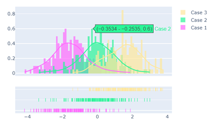

# MonteCarlo
* [中文版說明書](./README_%E4%B8%AD%E6%96%87.md)
### Introduction

* Monte Carlo simulation:
    By using multiple random sampling and simulation, various possibilities of groundwater flow can be obtained and the **uncertainty** of groundwater flow can be **quantified** to improve the accuracy and reliability of model prediction.

* Simulation method:

    1. Define the **Probability Density Function (PDF)** of the parameters, which can usually be established based on empirical formulas.
    2. Randomly sample the defined PDF to generate **realizations** and obtain the corresponding groundwater flow field.
    3. Repeat steps 1 and 2.
    4. For the n simulation results obtained in step 3, conduct statistical analysis such as calculating the mean, standard deviation, percentiles, etc., to obtain a statistical distribution that represents the simulation results.
    5. Based on the obtained statistical distribution, conduct risk assessment or other related applications, such as calculating the probability distribution of a certain water level or flux, or calculating the worst-case scenario under different water level or flux conditions.

* Tools used:
    * Numerical groundwater simulation tool: FEFLOW 7.3
    * Scripting language: Python 3.8.6

---

### Example

1. Use the **hydraulic conductivity (K)** as the uncertain parameter in the experiment.

2. Define the PDF of K based on empirical formulas

3. Use the stats module in Python to generate n random samples of K.

4. Conduct Monte Carlo simulation:
    * Set the sampled K values to the model using ifm.
    * Each time the K value is set, conduct simulation and record the velocity.
    * Repeat the above n times.

5. Visualize the results of the velocity obtained from n simulation runs. (`matplotlib`, `seaborn`, `plotly`, ...)
    

```python
# ifmMonteCarlo.py
import ifm
import sys
from scipy import stats
import numpy as np
import seaborn as sns

sys.path.append("C:\\Program Files\\DHI\\2020\\FEFLOW 7.3\\bin64")
doc = ifm.loadDocument('YOUR_FEM_FILE')

# Hydraulic conductivity (K)
# K ~ log-normal-distribution
# mu: mean of K (m/s)
# sigma: standard deviation of K (m/s)
# Ref: https://en.wikipedia.org/wiki/Log-normal_distribution
mu, sigma = 1e-3, 1e-4
conductivity = stats.norm.rvs(loc=np.math.log(mu**2/(mu**2+sigma**2)**0.5), scale=np.math.log((sigma/mu)**2+1)**0.5, size=100)
sns.distplot(conductivity)

# Ifm getter : number of elements
elements = doc.getNumberOfElements()

velocityX = []
for c in conductivity:
    c = np.math.exp(c)
    c *= 24 * 3600

    for element in range(elements):
        # Ifm setter : set the random sample of K
        doc.setMatXConductivityValue3D(element, c)
        doc.setMatYConductivityValue3D(element, c)
        doc.setMatZConductivityValue3D(element, 0.1*c)

    doc.startSimulator()

    # Ifm getter : get the velocity value
    velocityX.append(doc.getResultsXVelocityValue(300))

    doc.stopSimulator()

# Visualization the monte carlo simulatiuon
sns.distplot(velocityX)
```
