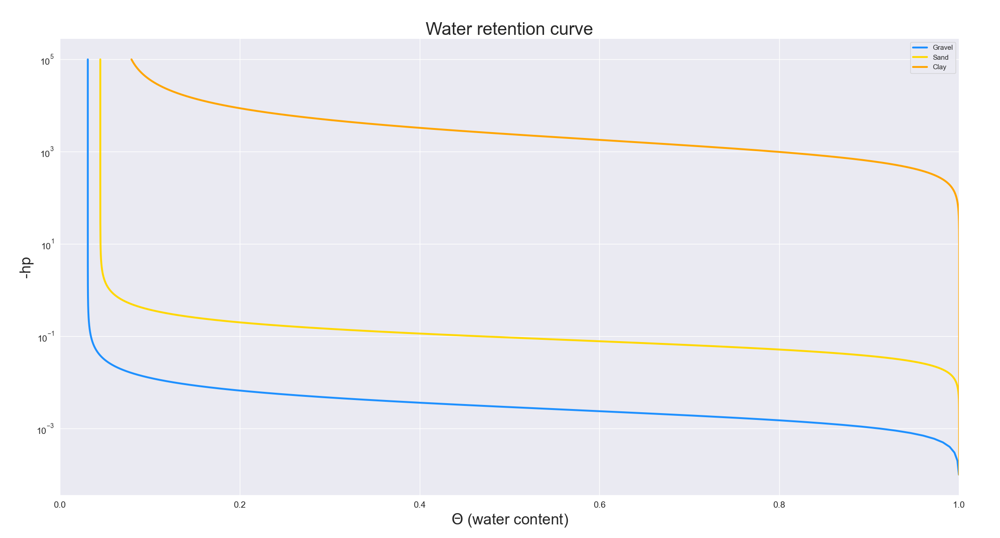

# Water Retention Curve
* [中文版說明書](./README_%E4%B8%AD%E6%96%87.md)

### Introduction

* Plot the "**Unsaturated Curve**".

* Input parameters:
    * `particle_types`
        > Rock properties, such as gravel layer, sand layer, or mud layer.
    * `saturation_capacity` [dimensionless]
        > Saturation capacity, generally set to 1.
    * `residual_saturation` [dimensionless]
        > Residual saturation, defined as the water content when the change gradient of water content (dθ /dh) is zero.
    * `air_entry_value` [1/m]
        > Related to the air entry value, the larger "a" is, the steeper the curve.
    * `pore_size_distribution` [dimensionless]
        > lated to the distribution of soil pore size, the more uniform the distribution of soil pore size, the smaller n, the smoother and gentler the curve, and the larger the value of "n".

---

### Example

* The rock layers and their unsaturated parameters are shown in the following table:
    |Rock Layer|Gravel Layer|Sand Layer|Mud Layer|
    | -- | -- | -- | -- |
    | Sr | 0.0311 | 0.045 | 0.068 |
    | a  | 493. | 14.5 | 0.068 |
    | n  | 2.4476 | 2.68 | 2. |

* Simulation result plot:
    
